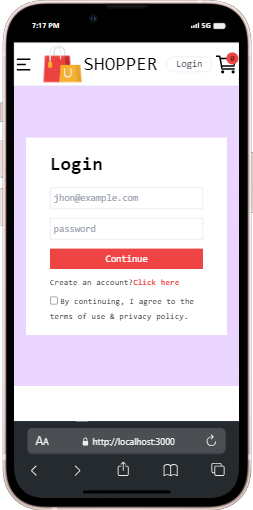

# E-commerce App README

## Description

This is an e-commerce web application built with React. It allows users to browse products, add them to the cart, and proceed to checkout.

## Installation


1. Clone the repository to your local machine:

   ```bash
   git clone https://github.com/0uali-Yassine/E-commerce-v1-app.git

2. Navigate to the project directory:

    ```bash
    cd E-commerce-v1-app

3. Install dependencies:

   ```bash
    npm install

4. Start the development server:
    ```bash
    npm start

5. Open your browser and visit http://localhost:3000 to view the website.


## Features
1. Browse products by category (Men, Women, Kids).
2. View product details.
3. Add products to the cart.
4. Remove products from the cart.
5. Proceed to checkout.

## Folder Structure

## Folder Structure
```
├── src/
│   ├── component/
│   │   ├── Navbar.js
│   │   ├── Footer.js
│   │   ├── Model.js
│   │   ├── Shop.js
│   │   ├── Login.js
│   │   ├── Signup.js
│   │   ├── Productinfo.js
│   │   ├── Cart.js
│   │   └── Menubar.js
│   ├── Context.js
│   ├── reducer/
│   │   └── reducer.js
│   ├── assest/
│   ├── data/
│   └── App.js
├── public/```
├── package.json
└── README.md
```


## Technologies Used

- **React** Frontend library for building user interfaces.
- **React Router** 
- **Tailwind CSS** Tailwind CSS is a utility-first CSS framework for rapidly building modern websites without ever leaving your HTML.
- **Context API:** Used for managing global state across components.
- **JavaScript:** Programming language for interactivity and functionality.

## Screenshots





## Contributing

Contributions are welcome! If you'd like to contribute to this project, please fork the repository, make your changes, and submit a pull request.

## Author
[Yassin Zerouali] - [https://github.com/0uali-Yassine]

## License

This project is licensed under the MIT License - see the [LICENSE](LICENSE) file for details.
